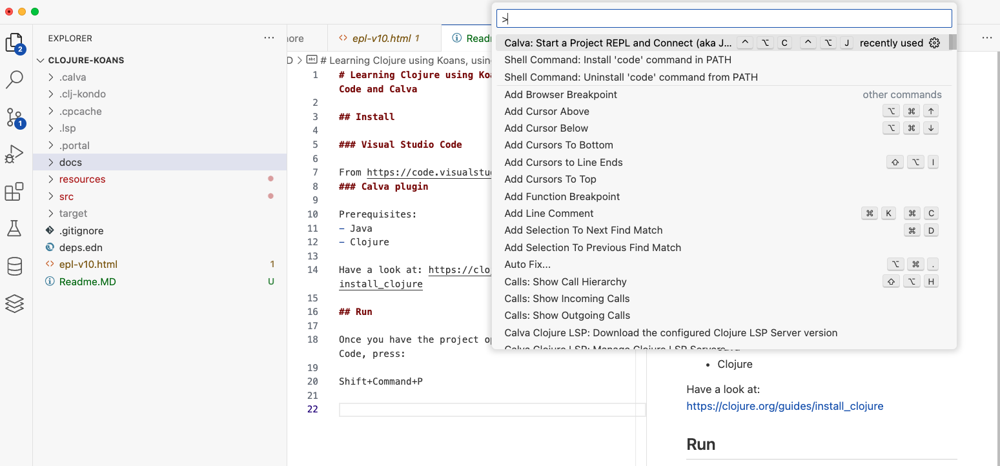
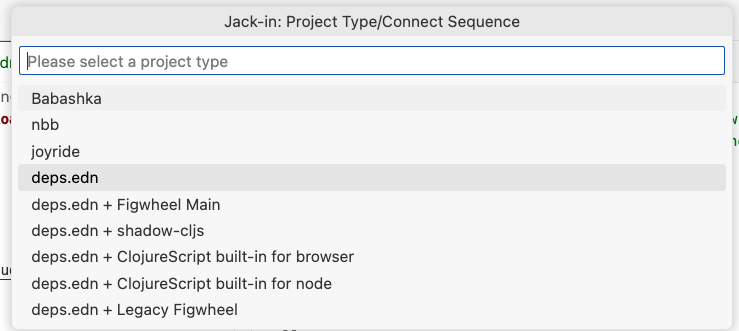
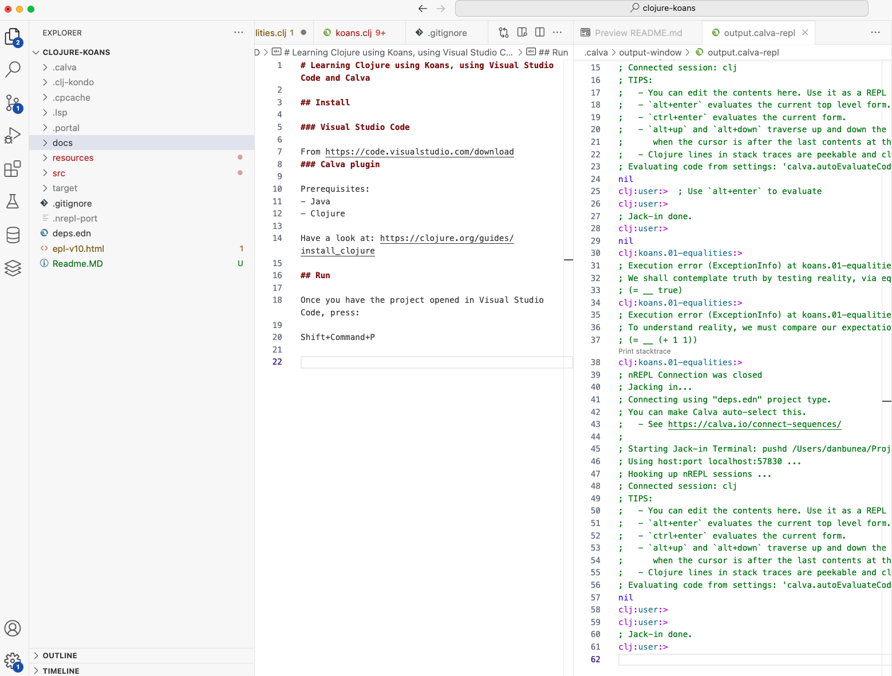
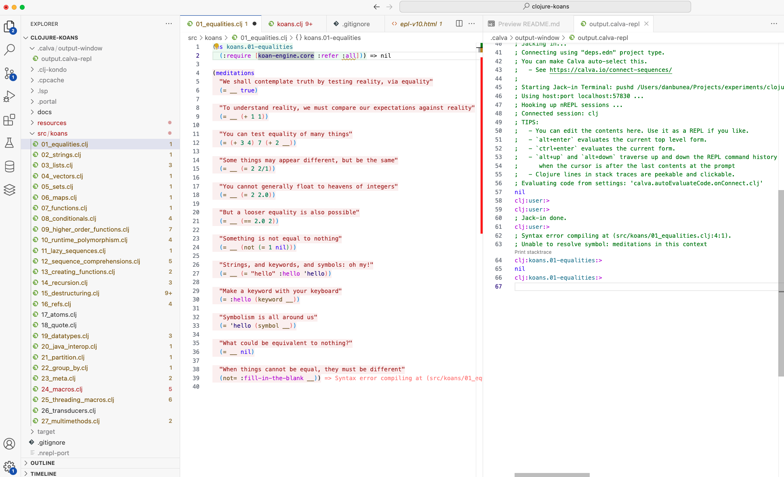
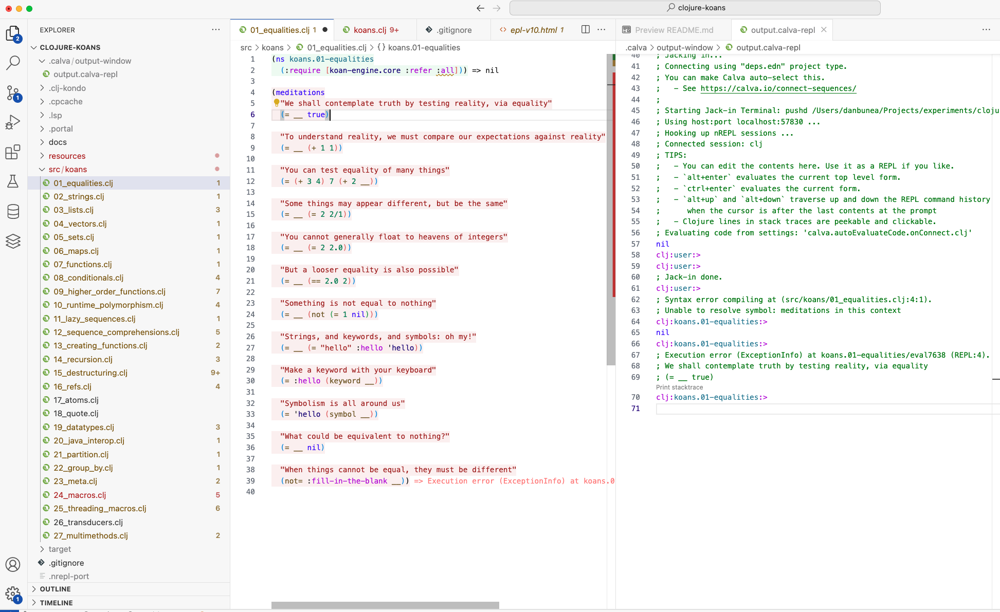
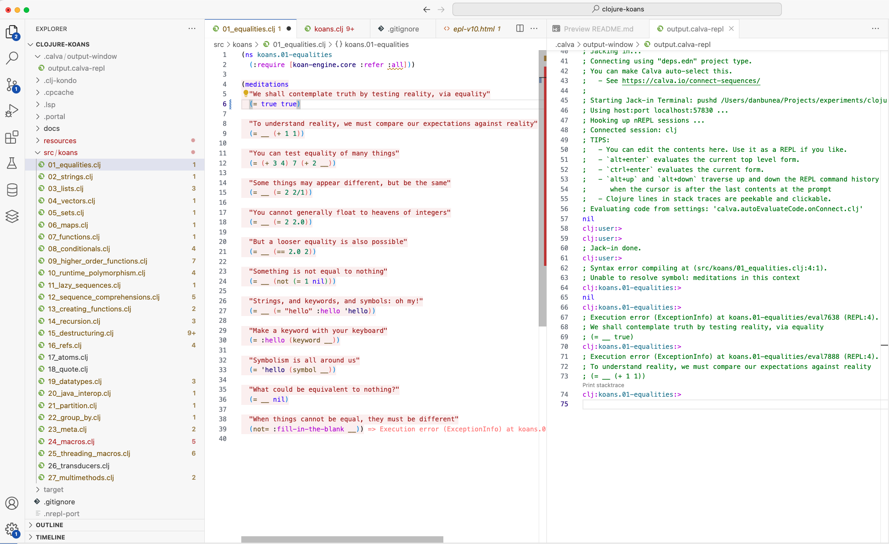

# Learning Clojure using Koans (thanks to https://github.com/functional-koans/clojure-koans ), using Visual Studio Code and Calva

## Install

### Visual Studio Code

From https://code.visualstudio.com/download 
### Calva plugin

Prerequisites:
- Java
- Clojure 

Have a look at: https://clojure.org/guides/install_clojure

## Run

Once you have the project opened in Visual Studio Code, press:

Shift+Command+P



Choose the > Calva Start a project REPL and connect to it. Then choose deps.edn



A new window will appear and it will end with "Jack-in done"



Then open src/01_equalities.clj



and evaluate the first form:

Presss Option+Enter with the cursor right after

```
(ns koans.01-equalities
  (:require [koan-engine.core :refer :all]))
```

Then evaluate the second form:

Presss Option+Enter with the cursor right after

```
(= __ true)
```



This will show you in the repl window:

- clj꞉koans.01-equalities꞉> 
; Execution error (ExceptionInfo) at koans.01-equalities/eval7638 (REPL:4).
; We shall contemplate truth by testing reality, via equality
; (= __ true)

meaning you need to say what is equal to true.

Fixing it:

```
(= true true)
```

and reevaluating the form will give you the next exercise to solve:



- clj꞉koans.01-equalities꞉> 
; Execution error (ExceptionInfo) at koans.01-equalities/eval7888 (REPL:4).
; To understand reality, we must compare our expectations against reality
; (= __ (+ 1 1))


